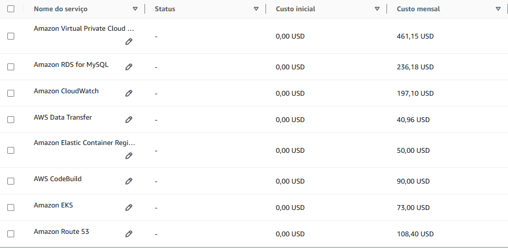

# ☁️ Projeto Final do Programa de Bolsas da Compass Uol

    

---

## 👥 Integrantes

- Carlos Henrique de Almeida Martins
- Nicole Evelyn Oliveira Profeta

---

## 🔍 Apresentação do Projeto

A empresa "Fast Engineering S/A" está em busca de uma solução da empresa terceira "TI SOLUÇÕES INCRÍVEIS". O eCommerce da "Fast Engineering S/A" está em expansão e a solução atual não está mais suportando o aumento significativo de acessos e compras, que têm crescido 20% ao mês desde o início do ano.

### 🛠️ Tecnologias Atuais

- 01 servidor para Banco de Dados MySQL
- 01 servidor para a aplicação utilizando REACT
- 01 servidor de web server que armazena estáticos como fotos e links

### 📈 Requisitos da Nova Arquitetura

Para a construção da arquitetura do futuro website da "Fast Engineering S/A", é necessário seguir as melhores práticas DevOps, incluindo:

- Ambiente Kubernetes
- Banco de dados PaaS
- MultiAZ
- Segurança de backup de dados
- Persistência dos dados
- Balanceamento de carga com healthcheck
- Segurança

---

## 📚 Documentação

### 🏢 Cenário Atual (On-premise)

Ambiente com três servidores:

- **Front-end Web:** Interface para os clientes.
- **Back-end API:** Processa solicitações e gerencia lógica de negócios.
- **Banco de Dados MySQL:** Armazena informações críticas.

Comunicação:

- Clientes acessam o ambiente on-premise diretamente.

### 🚀 Arquitetura de Migração

A arquitetura de migração proposta para o eCommerce da "Fast Engineering S/A" é composta por 3 servidores, sendo um para o Banco de Dados MySQL, um para a aplicação utilizando REACT e um para o servidor de web server que armazena estáticos como fotos e links. Será usado o MGN para a migração dos dados, DMS para a replicação dos dados e o RDS para o banco de dados. S3 para armazenamento de arquivos estáticos.

    

    <strong>Arquitetura de Migração</strong>

### 🔄 Fluxo de Migração

#### Passo 1: Replicação de Dados

**Replication Agent:**

- **Configuração:** O Replication Agent é configurado no ambiente on-premise para iniciar a replicação dos dados.
- **Transferência de Dados:** Utiliza a porta TCP 1500 para transferir dados para o Replication Server na AWS. Esta porta é usada especificamente para a transferência de dados de forma segura e eficiente.

**Replication Server:**

- **Hospedagem:** O Replication Server é hospedado na AWS dentro de uma VPC em uma subnet pública.
- **Armazenamento:** Conecta-se ao EBS (Elastic Block Store) para armazenar os dados replicados. O EBS oferece armazenamento persistente de alta disponibilidade e desempenho.

#### Passo 2: Controle e Integração

**Replication Agent:**

- **Comunicação:** Utiliza a porta TCP 443 para comunicação com o AWS MGN (Application Migration Service). Esta porta é usada para protocolos de controle e gerenciamento.
- **Backup:** Envia dados ao Amazon S3 para backup. O Amazon S3 oferece armazenamento escalável e durável para backup de dados.

#### Passo 3: Migração de Banco de Dados

**Banco de Dados On-premise:**

- **Transferência de Dados:** Utiliza a porta TCP 3306 para enviar dados ao MGN na AWS. Esta porta é padrão para comunicação com bancos de dados MySQL.
- **MGN:** O MGN está em uma subnet privada de uma nova VPC. Ele gerencia a transferência segura e eficiente dos dados para o Amazon RDS.
- **Amazon RDS:** O MGN transfere os dados para o Amazon RDS, que gerencia o banco de dados MySQL migrado.

### 🌐 Nova Infraestrutura na AWS

#### Camada de Banco de Dados

**Amazon RDS:**

- **Gerenciamento:** Gerencia o banco de dados MySQL migrado, oferecendo alta disponibilidade, escalabilidade e segurança.
- **Conexão:** Conecta-se ao EC2 back-end para fornecer dados às aplicações.

#### Camada Back-end

**EC2 back-end:**

- **Hospedagem:** Hospeda serviços como API, API2 e servidor Nginx.
- **Armazenamento:** Conexão bidirecional com o EBS para armazenamento persistente.
- **Balanceamento de Carga:** Utiliza um Load Balancer para distribuir o tráfego de forma eficiente e garantir alta disponibilidade.

#### Camada Front-end

**Load Balancer:**

- **Distribuição de Tráfego:** Distribui o tráfego para o EC2 back-end, garantindo que as solicitações dos clientes sejam atendidas de forma eficiente.
- **Conexões:** Conecta-se ao EBS e ao EC2 front-end.

**EC2 front-end:**

- **Interface Web:** Fornece a interface web para os clientes.
- **Comunicação:** Comunicação bidirecional com o EBS para acesso a dados estáticos e dinâmicos.

## 💰 Calculadora de Custos

### AWS Pricing Calculator

**Data da estimativa:** 29 de janeiro de 2025

**Custo inicial:** 0,00 USD

**Custo mensal:** 1.256,79 USD

**Custo total de 12 meses:** 15.081,48 USD

### Resumo da Estimativa

- **Amazon EC2 (FrontEnd):**

  - Custo inicial: 0,00 USD
  - Custo mensal: 3,69 USD
  - Região: Leste dos EUA (N. da Virgínia)

- **Amazon EC2 (BackEnd):**

  - Custo inicial: 0,00 USD
  - Custo mensal: 7,26 USD
  - Região: Leste dos EUA (N. da Virgínia)

- **Amazon RDS for MySQL:**

  - Custo inicial: 0,00 USD
  - Custo mensal: 236,18 USD
  - Região: Leste dos EUA (N. da Virgínia)

- **Amazon Simple Storage Service (S3):**

  - Custo inicial: 0,00 USD
  - Custo mensal: 23,01 USD
  - Região: Leste dos EUA (N. da Virgínia)

- **Amazon Virtual Private Cloud (VPC):**
  - Custo inicial: 0,00 USD
  - Custo mensal: 514,93 USD
  - Região: Leste dos EUA (N. da Virgínia)

    

## 🛠️ Serviços Utilizados

- **Amazon EKS (Elastic Kubernetes Service):** Serviço gerenciado de Kubernetes que facilita a execução de clusters Kubernetes na AWS.
- **Amazon RDS (Relational Database Service):** Serviço gerenciado de banco de dados relacional que facilita a configuração, operação e escalabilidade de bancos de dados na nuvem.
- **Amazon S3 (Simple Storage Service):** Serviço de armazenamento de objetos que oferece escalabilidade, disponibilidade de dados, segurança e desempenho.
- **Amazon CloudFront:** Serviço de rede de entrega de conteúdo (CDN) que distribui conteúdo globalmente com baixa latência e alta velocidade de transferência.
- **Amazon Route 53:** Serviço de DNS gerenciado que oferece roteamento de tráfego na web e monitoramento de integridade.
- **Amazon CloudWatch:** Serviço de monitoramento e gerenciamento que coleta e rastreia métricas, coleta e monitora arquivos de log e define alarmes.
- **AWS WAF (Web Application Firewall):** Firewall de aplicação web que ajuda a proteger aplicações web contra explorações da web comuns.
- **AWS Secrets Manager:** Serviço para gerenciar, recuperar e rotacionar credenciais de banco de dados, chaves de API e outros segredos.
- **AWS KMS (Key Management Service):** Serviço de gerenciamento de chaves que facilita a criação e controle de chaves de criptografia usadas para proteger dados.
- **AWS CodeBuild:** Serviço de integração contínua que compila código fonte, executa testes e produz pacotes de software prontos para implantação.
- **AWS ECR (Elastic Container Registry):** Registro de contêineres gerenciado que facilita o armazenamento, gerenciamento e implantação de imagens Docker.
- **Amazon VPC (Virtual Private Cloud):** Serviço que permite provisionar uma seção logicamente isolada da nuvem AWS onde você pode lançar recursos AWS em uma rede virtual que você define.
- **Amazon EC2 (Elastic Compute Cloud):** Serviço que fornece capacidade de computação redimensionável na nuvem, permitindo a execução de instâncias de servidor virtual.

## 📚 Referências

- [AWS EKS User Guide](https://docs.aws.amazon.com/pt_br/eks/latest/userguide/kubernetes-concepts.html)
- [AWS DMS](https://aws.amazon.com/pt/dms/)
- [AWS Application Migration Service](https://aws.amazon.com/pt/application-migration-service/)

---

## Créditos

Este projeto foi fornecido pela empresa Compass UOL.
