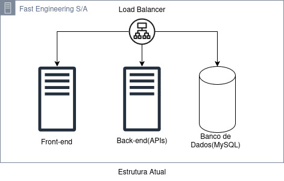
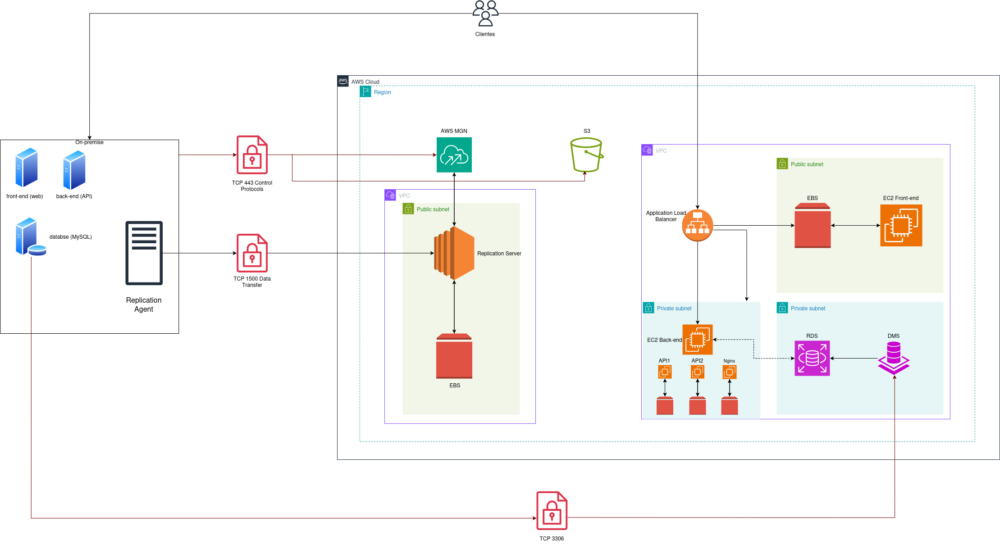

# ☁️ Projeto final do programa de bolsas da Compass Uol

    

---

## 👥 Integrantes

- Carlos Henrique de Almeida Martins
- Nicole Evelyn Oliveira Profeta

---

## 🔍 Apresentação do projeto

A empresa "Fast Engineering S/A" está em busca de uma solução da empresa terceira "TI SOLUÇÕES INCRÍVEIS". O eCommerce da "Fast Engineering S/A" está em expansão e a solução atual não está mais suportando o aumento significativo de acessos e compras, que têm crescido 20% ao mês desde o início do ano.

### Tecnologias atuais

- 01 servidor para Banco de Dados MySQL
- 01 servidor para a aplicação utilizando REACT
- 01 servidor de web server que armazena estáticos como fotos e links

### Requisitos da Nova Arquitetura

Para a construção da arquitetura do futuro website da "Fast Engineering S/A", é necessário seguir as melhores práticas DevOps, incluindo:

- Ambiente Kubernetes
- Banco de dados PaaS
- MultiAZ
- Segurança de backup de dados
- Persistência dos dados
- Balanceamento de carga com healthcheck
- Segurança

---

## 📚 Documentação

### Arquitetura Atual

A arquitetura atual do eCommerce da "Fast Engineering S/A" é composta por 3 servidores, sendo um para o Banco de Dados MySQL, um para a aplicação utilizando REACT e um para o servidor de web server que armazena estáticos como fotos e links.

    

    <strong>Arquitetura Atual</strong>

### Arquitetura De Migração

A arquitetura de migração proposta para o eCommerce da "Fast Engineering S/A" é composta por 3 servidores, sendo um para o Banco de Dados MySQL, um para a aplicação utilizando REACT e um para o servidor de web server que armazena estáticos como fotos e links. Será usado o MGN para a migração dos dados, DMS para a replicação dos dados e o RDS para o banco de dados. S3 para armazenamento de arquivos estáticos.

    

    <strong>Arquitetura de Migração</strong>

### Arquitetura Moderna

---

## 🛠️ Serviços Utilizados

## Implementação
